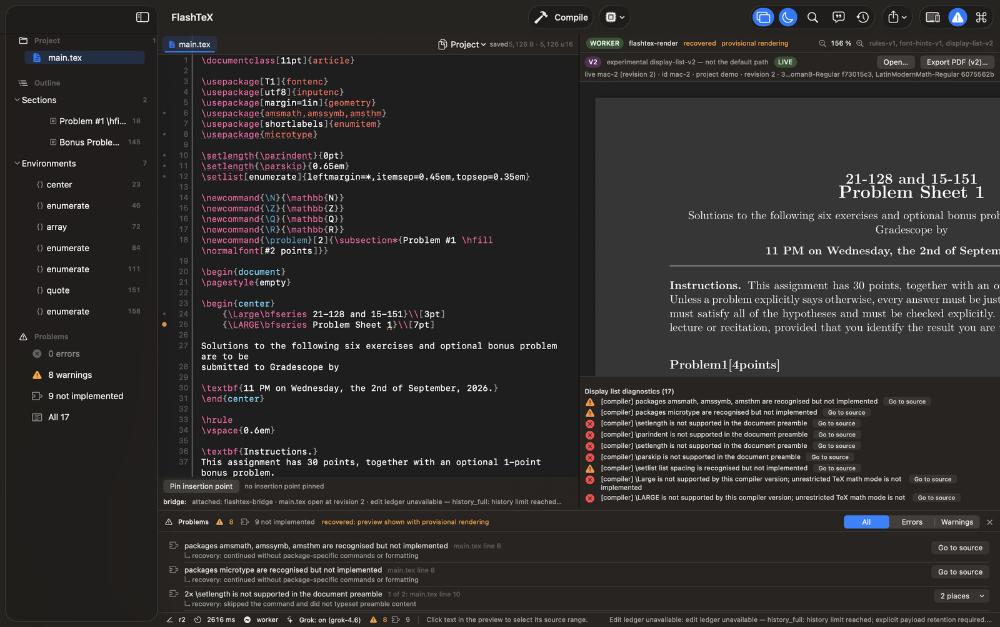

# FlashTeX

**A native LaTeX IDE for macOS with its own incremental LaTeX engine — no TeX
distribution required.**

FlashTeX is a Swift app over a Rust engine. You type LaTeX, and the page
re-renders as you type: the engine (`flashtex-render`) lexes, lays out and
paints a document in tens of milliseconds, using the same TeX font metrics as
pdfLaTeX and the real Latin Modern faces (Computer Modern design; New Computer
Modern Math for the blackboard-bold and `amssymb` glyphs), and exports PDFs
with its own bundled writer. An iPad companion (FlashTeXPad) turns Pencil sketches
and photos into reviewed LaTeX/TikZ insertions. Everything runs as small
helper processes that speak JSON Lines, so the engine, the editor and the
companions are independently replaceable and scriptable.

What it is **not** (yet): a full TeX engine. FlashTeX implements a growing
subset of LaTeX (article-class text, sectioning, lists, `amsmath`-style math,
`\newcommand`, `\input`/`\include`, labels and references); constructs it does
not implement are reported as diagnostics with a recovery note rather than
silently dropped, and images, tables, bibliographies and most packages are
still missing. See [Supported LaTeX](docs/user/compiler.md#supported-latex)
for the current list.



## Features

- **Workspace and multi-file projects** — a `.tex` file and its folder are the
  project; `\input`/`\include` targets appear in the sidebar with an outline of
  sections, environments and labels.
- **Editor** — LaTeX syntax highlighting, completion for commands, environments
  and labels (⌃Space), a command palette (⌘⇧P).
- **Per-keystroke incremental compile** — every edit is compiled by the bundled
  engine; only the paragraphs you touched are re-typeset.
- **Live preview** — an exact display list painted with Latin Modern glyphs,
  zoom (⌘= / ⌘- / fit width ⌘9 / actual size ⌘0), click-to-source, caret sync
  (⌘⇧J), dark preview.
- **Diagnostics** — errors, warnings and "not implemented" notes in a Problems
  panel (⌘⇧M) with go-to-source, grouped duplicates, explanations and quick
  fixes where one exists.
- **PDF export** — the bundled writer embeds Latin Modern subsets with the
  original glyph IDs and positions; no TeX installation is involved.
- **iPad companion** — pair FlashTeXPad over the local network, capture a
  sketch or photo, review the proposed LaTeX/TikZ on the Mac and insert it as
  one undoable edit.
- **Helper-process architecture** — engine, PDF writer, capture bridge, edit
  ledger and project index are separate Rust binaries with documented JSON
  Lines contracts, usable from any editor or script.

## Benchmarks

Measured on 2026-09-13 on an Apple M1 Max (MacBook Pro), macOS 26.3.1
(25D2128), this checkout at `a03b15fd`, `flashtex-render` built with
`cargo build --release` (rustc 1.99.0-nightly). The comparison oracle is
pdfTeX 3.141592653-2.6-1.40.29 (TeX Live 2026, MacTeX). pdflatex never runs
inside the product; it is only used to compare.

**Full render, single document, no bibliography or images.** `HW1.tex` and
`HW2.tex` are two real problem sets (5.1 KB, 134–140 lines each, `article`
11pt with `amsmath`/`amssymb`/`enumitem`/`geometry`). Median of 5 runs, best in
parentheses; each run is a fresh process.

| Document | `flashtex-render` in-process render | `flashtex-render` process wall (`--tex`, writes PDF) | `pdflatex -interaction=batchmode` wall (one pass) |
|---|---:|---:|---:|
| `fixtures/real-world/hw1/HW1.tex` (3 pages) | 47.4 ms (46.5 ms) | 56.0 ms (54.1 ms) | 547.5 ms (536.2 ms) |
| `fixtures/real-world/hw2/HW2.tex` (3 pages in pdflatex, 4 in FlashTeX) | 46.9 ms (46.9 ms) | 56.4 ms (54.9 ms) | 551.9 ms (534.4 ms) |

Both documents render with status `recovered` (8 and 19 diagnostics for
package features that are recognised but not implemented). The pdflatex
column is a single pass with a warm font cache; a real build usually needs two
or three passes for references.

**Edit-to-preview latency in the app** (keystroke → painted preview, release
build, programmatic typing at 30 ms intervals, engine attached through the
preview controller; from
[`docs/evidence/typing-bench-2026-09-12T102931Z.md`](docs/evidence/typing-bench-2026-09-12T102931Z.md)):

| Document | keystroke → paint p50 | p95 | p99 | compile p50 |
|---|---:|---:|---:|---:|
| `demo.tex` (6 KB) | 48 ms | 64 ms | 69 ms | 16 ms |
| 60 KB single-file body | 195 ms | 227 ms | 238 ms | 43 ms |

"Paint" is the completed CoreAnimation commit; the pixels reach the display
at the next vsync. One machine, one run per row, indicative only — the report
lists every limitation.

**App launch to first preview.** Launching the built `FlashTeX.app` binary
with `HW1.tex` as the seed document (5 fresh processes, app already on disk):
engine attached after 41–71 ms, first compile result after 166–215 ms, first
painted preview after **1.18–1.30 s** (median 1.24 s). This was measured for
this README; there is no separate evidence report for it yet.

<details>
<summary>Exact commands</summary>

```sh
# Engine (from the repository root; --font-dir points at the bundled Latin Modern faces)
cargo build --release --manifest-path crates/render-pipeline/Cargo.toml
for i in 1 2 3 4 5; do
  /usr/bin/time -p crates/render-pipeline/target/release/flashtex-render \
    --tex fixtures/real-world/hw1/HW1.tex --pdf /tmp/hw1.pdf --timing --font-dir apps/mac/Fonts
done
# The "rendered in N ms" line on stderr is the in-process time; `real` is the process wall time
# (a Python `subprocess` + `perf_counter` loop was used for the sub-10 ms wall figures above).

# Oracle (in a scratch directory so aux files do not touch the fixture)
T=$(mktemp -d) && cp fixtures/real-world/hw1/HW1.tex "$T" && cd "$T"
for i in 1 2 3 4 5; do /usr/bin/time -p /Library/TeX/texbin/pdflatex -interaction=batchmode HW1.tex >/dev/null; done

# Typing bench (app): tools/typing-bench/run.sh — see the evidence report for the exact invocation.

# Launch to first preview: run the app binary with
#   FLASHTEX_AUTOATTACH=1 FLASHTEX_NO_ACTIVATE=1 FLASHTEX_SEED_FILE=fixtures/real-world/hw1/HW1.tex FLASHTEX_LOG=/tmp/ft.log
# and time the "attached: flashtex-render", "status: revision 2: recovered" and "paint: revision 2" log lines.
```

</details>

## Installation

Requirements: **macOS 14 Sonoma or later on Apple Silicon** (arm64). No Intel,
Windows or Linux app; no TeX installation is needed — the app bundles the
engine, Latin Modern fonts and TeX metrics.

**One line** (downloads the pinned release DMG, verifies its SHA-256, installs
into `/Applications` or `~/Applications`, strips quarantine):

```sh
curl -fsSL https://flash-tex.github.io/flashtex/install.sh | sh
```

**Disk image.** Download `FlashTeX.dmg` from
[Releases](https://github.com/flash-tex/flashtex/releases) and drag FlashTeX
into Applications. The app is ad-hoc signed, not notarized: the first time,
**right-click → Open** and confirm.

**Command-line tools only.** Each release also ships
`flashtex-cli-<version>-macos-arm64.tar.gz` (and a best-effort
`linux-x86_64` tarball) with `flashtex-render`, `flashtex-compiler`,
`flashtex-pdf`, `flashtex-pdf-exact` and the fonts/metrics they need.

**From source** (Xcode Command Line Tools with Swift 6, stable Rust from rustup;
there is no root Cargo workspace, each crate builds on its own):

```sh
git clone https://github.com/flash-tex/flashtex.git && cd flashtex
scripts/ci/build-helpers.sh                 # release-builds every helper crate
apps/mac/scripts/make-app.sh --install      # packages FlashTeX.app into ~/Applications
apps/mac/scripts/make-app.sh --dmg          # or: build a disk image
```

Full details: [Getting started](docs/user/README.md) and
[Building from source](docs/user/compiler.md#building-from-source).

## Quick start — CLI

Render a `.tex` file to PDF. The app bundle and the CLI tarball find their
fonts next to the binary; with a source build add `--font-dir apps/mac/Fonts`
to every command below (both tools accept it, repeatably):

```sh
flashtex-render --tex main.tex --pdf main.pdf                    # diagnostics on stderr, exit 0
flashtex-render --tex main.tex --v2 main-v2.json --timing        # rendering-v2 display list + wall time
flashtex-pdf-exact from-v2 main-v2.json --out main-exact.pdf     # exact PDF with embedded Latin Modern subsets
```

Without `--tex`, `flashtex-render` is a long-running **JSON Lines worker** —
one `compile` request per stdin line, one `compile_result` per stdout line —
which is how the app drives it. From a shell:

```sh
python3 -c 'import json,sys;print(json.dumps({"protocol_version":1,"id":"1","type":"compile","payload":{"project_id":"cli","revision":1,"entry_path":"main.tex","documents":[{"path":"main.tex","text":open(sys.argv[1]).read()}]}}))' main.tex \
  | flashtex-render --pdf main.pdf > result.jsonl
```

Exit codes in `--tex` mode: `0` when the document rendered (`ok` or
`recovered` with diagnostics), `1` when it `failed` (no pages), `2` when the
file cannot be read or an argument is unknown. The reply format, the font
search order, `flashtex-compiler`, `flashtex-pdf` and every diagnostic code
are documented in [Command-line tools](docs/user/compiler.md).

## Quick start — IDE

1. **Open FlashTeX**, then *File › Open LaTeX File…* (⌘O) — or type into the
   sample buffer and ⌘⇧S to save it. The file becomes the entry document and
   its folder the project root; the bundled engine attaches automatically.
2. **Type.** Auto-compile is on (⌘B compiles on demand); zoom the preview with
   ⌘= / ⌘-, click any word to jump to its source, open **Problems** (⌘⇧M) to
   see and fix diagnostics.
3. **Export** with *File › Export PDF (exact, v2)…*; **pair an iPad** with
   *Edit › Nearby Companion…* (⌘⇧N) → Advertise → Show Pairing Code, then scan
   the code from FlashTeXPad.

Everything else — projects, IntelliSense, the AI assistant, preferences and
the full shortcut table — is in [The Mac app](docs/user/gui.md); the
companion is in [FlashTeXPad for iPad](docs/user/ipad.md).

## Architecture

The Mac app never links the engine. It launches helper processes and talks to
them over stdin/stdout with versioned JSON Lines contracts
([runtime-v1](docs/contracts/runtime-v1.md), the rendering-v2 display list in
[`protocol/`](protocol/)); a crashed helper is relaunched and the last good
preview stays on screen. The same contracts make the engine usable from other
editors and CI.

```
crates/
  compiler/          lexer, LaTeX subset, runtime-v1 JSON Lines worker (flashtex-compiler)
  render-pipeline/   the engine: parse tree → styled blocks → shaping → Knuth-Plass →
                     Appendix G math → pages → display list (flashtex-render)
  font-engine/, font-resources/, math-layout/, paragraph-layout/, document-style/, …
  pdf/               PDF writer (flashtex-pdf, flashtex-pdf-exact)
  bridge/            iPad capture receipt, conversion, reviewed edits (flashtex-bridge)
  project-files/, edit-ledger/, project-index/, preview-controller/, …
apps/mac/            the SwiftUI/AppKit IDE, bundled fonts and TeX metrics, packaging scripts
apps/ios/            FlashTeXPad, the iPad capture companion
protocol/            rendering-v2 schema and wire fixtures
fixtures/            real-world documents with pdfLaTeX reference PDFs
docs/                user guides, contracts, evidence reports
```

## Contributing

Issues and pull requests: <https://github.com/flash-tex/flashtex>. CI builds
and tests every crate, the Mac app and the iPad companion on each push; tagging
`vX.Y.Z` builds the DMG and CLI tarballs and publishes a release — see
[CI/CD](docs/ci-cd.md). Agents (Claude Code, Codex, Cursor) working in this
repository must follow [AGENTS.md](AGENTS.md); the onboarding notes are in
[docs/agents/README.md](docs/agents/README.md).

## License

[MIT](LICENSE) © 2026 flash-tex. The bundled Latin Modern and New Computer
Modern fonts are under the [GUST Font License](apps/mac/Fonts/GUST-FONT-LICENSE.TXT)
(see [apps/mac/Fonts/README.md](apps/mac/Fonts/README.md)).
