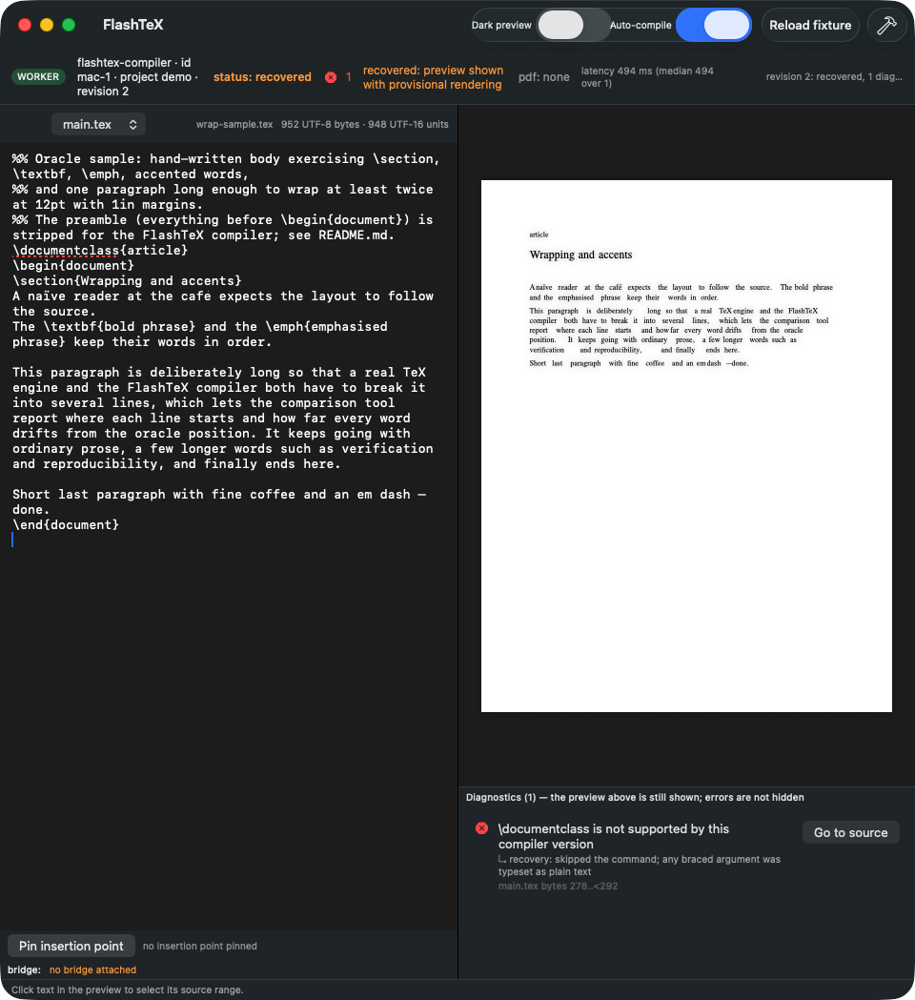

# FlashTeX native end-to-end report

- Generated: 2026-09-12T05:34:11Z on MacBook-Pro-206 (macOS 26.3.1, arm64); worker mac-native-e2e
- Mac shell: `origin/agent/mac-claude-a/mac-shell` = `4213ec9c1f39c7c51fe10fecf728779681873df2` (compiler discovered by the app = `crates/compiler` in that tree, last changed `9f1033b`)
- PDF writer: `origin/agent/mac-pdf/pdf-output` = `5b5f7b5bcbc44ba9376b3a237afe93ba1503d13c`; bridge: `origin/agent/commander/capture-bridge` = `b5ca96bdaca634166a01023cd3321955f2bc5f70`
- Suite: `d3754f983bbc980dea20443d710353000be807b0`; toolchain: swift-driver version: 1.127.15 Apple Swift version 6.2.4 (swiftlang-6.2.4.1.4 clang-1700.6.4.2); Xcode 26.3 Build version 17C529 ; cargo 1.99.0-nightly (3efb1f477 2026-07-17); Python 3.12.0
- Session: `launchctl managername` = Background; Accessibility for osascript UI scripting: not granted (see README); Screen Recording: see screenshot rows
- Scratch: `/var/folders/_0/d71mvr2d4_177qkm0506xl200000gn/T//flashtex-validation/e2e-20260912T053133Z` (logs not committed); overall: **PASS**

App-observed steps are things measured on the running `FlashTeXMac` process launched by this script (own PID only). CLI-equivalent steps run the same binaries the app's menu items invoke (`flashtex-compiler`, `flashtex-pdf --verify`) because menus cannot be driven without Accessibility.

## Checks

| Status | Check | Detail |
|---|---|---|
| PASS | build: crates/compiler in the Mac worktree (last change 9f1033b) | cargo build --release |
| PASS | build: crates/pdf (5b5f7b5bcbc44ba9376b3a237afe93ba1503d13c) | cargo build --release |
| PASS | build: crates/bridge (b5ca96bdaca634166a01023cd3321955f2bc5f70) | cargo build --release |
| PASS | build: apps/mac swift build (debug) | swift build |
| PASS | build: window_probe + oracle_extract (PDFKit) | swiftc |
| PASS | 1 app-observed: FlashTeXMac process alive 3 s after launch | pid 74810 |
| PASS | 1 app-observed: flashtex-compiler child attached (FLASHTEX_AUTOATTACH=1) | pgrep -P 74810 -f flashtex-compiler -> 74821 (/var/folders/_0/d71mvr2d4_177qkm0506xl200000gn/T/flashtex-validation/e2e-20260912T053133Z/mac/crates/compiler/target/rel) |
| PASS | 1 app-observed: window present (CGWindowListCopyWindowInfo) | window id 3773, 960x1049 pt, title FlashTeX |
| PASS | 1 app-observed: screenshot by window id | screencapture -x -o -l 3773 -> e2e-20260912T053133Z-check1-app.png: captured 231208 bytes 960 1049 px |
| PASS | 1 CLI-equivalent: flashtex-compiler compile_result for the seeded file | status/pages/diagnostics: recovered 1 1 |
| PASS | 1 CLI-equivalent: flashtex-pdf --verify wrote check1.pdf | 5087 bytes; warnings:  |
| PASS | 1 CLI-equivalent: PDFKit validation of check1.pdf (page count, expected words) | pages=1 words=99 expected-words-missing=[] |
| PASS | 2 CLI round trip x20 over Samples/demo.tex (5909 bytes) while the app is attached | LATENCY ms: n=20 min=1.295 median=1.339 max=3.574 bytes=5909 pages=3 status=ok |
| PASS | 2 in-app path: swift test --filter RealCompilerTests (debounce/coalescing) | REAL-COMPILER LATENCY ms: n=2 min=0.8350610733032227 median=6.684064865112305 max=6.684064865112305; 	 Executed 1 test, with 0 failures (0 unexpected) in 0.971 (0.973) seconds |
| PASS | 3 app survives SIGKILL of its compiler child for 5 s | child 74821 killed; app pid 74810 alive; new child:  (the app reports worker exit in its banner; it does not auto-respawn) |
| PASS | 3 relaunch re-attaches a compiler child | pid 76254 child 76258 |
| INFO | 3 orphaned compiler child after SIGKILL of the app | none |
| PASS | 3 relaunch after SIGKILL: window present within 5 s | 966 ms to window 3804 (960x1051 pt); child: 77150 |
| INFO | 3 screenshot after relaunch | captured 231073 bytes 960 1049 px |
| INFO | 4 run_all.sh re-run | overall: FAIL; report report-20260912T053243Z.md |
| INFO | 4 oracle_compare.sh --only fixture-hello re-run | report oracle-20260912T053409Z.md |
| INFO | 4 non-regression diff vs report-20260912T043142Z.md / oracle-20260912T050958Z.md | non-regression: 1 changed field(s): [CHANGED] run_all swift tests executed/failures: prev=34/0 new=75/0  |
| PASS | 5 bridge receipt path (document_open, destination_pin, capture_submit, duplicate, convert w/o --enable-grok, reject) | summary: 10 PASS, 0 FAIL, 0 INFO, 0 FINDING |

## Screenshots

- `e2e-20260912T053133Z-check1-app.png` (231208 bytes) 
- `e2e-20260912T053133Z-check3-relaunch.png` (231073 bytes) 

## Bridge replies

```
[PASS] bridge: process exit -- exit 0
[PASS] bridge: document_open -> document_opened -- {"id": "open", "payload": {}, "protocol_version": 1, "type": "document_opened"}
[PASS] bridge: destination_pin -> destination_pinned -- {"id": "pin", "payload": {"binding": {"end_byte": 5, "path": "main.tex", "project_id": "p", "revision": 1, "source_sha256": "f93bafb765f7646cf44f49557ae7fb29d271d43738b321eac3759755ff28ff2b", "start_b
[PASS] bridge: capture_submit -> capture_received durable:true -- {"id": "fixture-capture-request", "payload": {"applied": false, "capture_id": "fixture-capture-1", "durable": true, "has_proposal": false}, "protocol_version": 1, "type": "capture_received"}
[PASS] bridge: duplicate capture_submit -> same record (no second receipt id, same payload) -- {"id": "fixture-capture-request", "payload": {"applied": false, "capture_id": "fixture-capture-1", "durable": true, "has_proposal": false}, "protocol_version": 1, "type": "capture_received"}
[PASS] bridge: capture_convert without --enable-grok -> error provider_disabled -- {"id": "convert", "payload": {"code": "provider_disabled", "message": "Grok conversion requires explicitly enabled provider configuration"}, "protocol_version": 1, "type": "error"}
[PASS] bridge: capture_reject -> capture_rejected -- {"id": "reject", "payload": {"capture_id": "fixture-capture-1"}, "protocol_version": 1, "type": "capture_rejected"}
[PASS] bridge: capture_status -> rejected:true -- {"id": "status", "payload": {"applied": null, "capture_id": "fixture-capture-1", "prepared": null, "proposal": null, "rejected": true}, "protocol_version": 1, "type": "capture_status"}
[PASS] bridge: durable journal record on disk -- /var/folders/_0/d71mvr2d4_177qkm0506xl200000gn/T//flashtex-validation/e2e-20260912T053133Z/bridge-store: ['.bridge.lock', 'fixture-capture-1.json']
[PASS] fixture mac-shell: capture_submit accepted by the bridge (fixture owner: Commander) -- {"id": "fixture-capture-request", "payload": {"applied": false, "capture_id": "fixture-capture-1", "durable": true, "has_proposal": false}, "protocol_version": 1, "type": "capture_received"}
```

## Non-regression detail

```
[SAME] run_all overall: prev=FAIL new=FAIL
[SAME] run_all protocol FAIL rows: prev=protocol: check_protocol.py; fixture: protocol/fixtures/compile-result.json ranges slice to their texts (owner: Commander) new=protocol: check_protocol.py; fixture: protocol/fixtures/compile-result.json ranges slice to their texts (owner: Commander)
[SAME] run_all protocol PASS/FAIL/INFO: prev=20/1/6 new=20/1/6
[SAME(within 2x)] run_all protocol latency min/median/max ms: prev=0.26/0.28/0.41 new=0.25/0.28/0.42
[SAME] run_all step cargo build --release: prev=PASS new=PASS
[SAME] run_all step cargo test --release: prev=PASS new=PASS
[SAME] run_all step check_protocol.py: prev=FAIL new=FAIL
[SAME] run_all step swift build: prev=PASS new=PASS
[SAME] run_all step swift test: prev=PASS new=PASS
[SAME] run_all step xcodebuild build: prev=PASS new=PASS
[CHANGED] run_all swift tests executed/failures: prev=34/0 new=75/0
[SAME] oracle fixture-hello/A-default/de1020c
[SAME] oracle fixture-hello/A-default/main
[SAME] oracle fixture-hello/B-times12-1in/de1020c
[SAME] oracle fixture-hello/B-times12-1in/main
[SAME] oracle fixture-hello/C-times12-1in-ragged/de1020c
[SAME] oracle fixture-hello/C-times12-1in-ragged/main

non-regression: 1 changed field(s)
```

## Commands

| Scope | Command | Exit | Duration | Log |
|---|---|---|---|---|
| build | `cargo build --release` | 0 | 1.277 s | logs/cargo-compiler.log |
| build | `cargo build --release` | 0 | 1.750 s | logs/cargo-pdf.log |
| build | `cargo build --release` | 0 | 23.692 s | logs/cargo-bridge.log |
| build | `swift build` | 0 | 13.526 s | logs/swift-build.log |
| build | `bash -c swiftc -O '/Users/jay3332/Projects/flashtex/.claude/worktrees/agent-a6f18f4a6d5337f3b/tools/native-validation/window_probe.swift' -o '/var/folders/_0/d71mvr2d4_177qkm0506xl200000gn/T//flashtex-validation/e2e-20260912T053133Z/window_probe' && swiftc -O '/Users/jay3332/Projects/flashtex/.claude/worktrees/agent-a6f18f4a6d5337f3b/tools/native-validation/oracle_extract.swift' -o '/var/folders/_0/d71mvr2d4_177qkm0506xl200000gn/T//flashtex-validation/e2e-20260912T053133Z/oracle_extract'` | 0 | 2.136 s | logs/swiftc-probes.log |
| app | `FLASHTEX_REPO=/var/folders/_0/d71mvr2d4_177qkm0506xl200000gn/T//flashtex-validation/e2e-20260912T053133Z/mac FLASHTEX_AUTOATTACH=1 FLASHTEX_SEED_FILE=/Users/jay3332/Projects/flashtex/.claude/worktrees/agent-a6f18f4a6d5337f3b/tools/native-validation/oracle-samples/wrap-sample.tex /var/folders/_0/d71mvr2d4_177qkm0506xl200000gn/T//flashtex-validation/e2e-20260912T053133Z/mac/apps/mac/.build/debug/FlashTeXMac &` (pid 74810) | - | - | logs/app-check1.log |
| check1 | `bash -c '/var/folders/_0/d71mvr2d4_177qkm0506xl200000gn/T//flashtex-validation/e2e-20260912T053133Z/mac/crates/compiler/target/release/flashtex-compiler' < check1-request.json > check1-result.json` | 0 | 0.034 s | logs/cli-compile.log |
| check1 | `/var/folders/_0/d71mvr2d4_177qkm0506xl200000gn/T//flashtex-validation/e2e-20260912T053133Z/pdf/crates/pdf/target/release/flashtex-pdf check1-result.json --out check1.pdf --verify` | 0 | 0.226 s | logs/cli-pdf.log |
| check2 | `python3 /Users/jay3332/Projects/flashtex/.claude/worktrees/agent-a6f18f4a6d5337f3b/tools/native-validation/e2e_latency.py --compiler /var/folders/_0/d71mvr2d4_177qkm0506xl200000gn/T//flashtex-validation/e2e-20260912T053133Z/mac/crates/compiler/target/release/flashtex-compiler --document /var/folders/_0/d71mvr2d4_177qkm0506xl200000gn/T//flashtex-validation/e2e-20260912T053133Z/mac/apps/mac/Samples/demo.tex --count 20 --json /var/folders/_0/d71mvr2d4_177qkm0506xl200000gn/T//flashtex-validation/e2e-20260912T053133Z/check2-latency.json` | 0 | 0.144 s | logs/cli-latency.log |
| check2 | `env FLASHTEX_COMPILER=/var/folders/_0/d71mvr2d4_177qkm0506xl200000gn/T//flashtex-validation/e2e-20260912T053133Z/mac/crates/compiler/target/release/flashtex-compiler swift test --filter RealCompilerTests` | 0 | 10.166 s | logs/swift-test-real.log |
| check3 | `kill -9 74821` (compiler child) | 0 | - | - |
| check3 | `kill 74810` (SIGTERM app) | 0 | - | - |
| app | `FLASHTEX_REPO=/var/folders/_0/d71mvr2d4_177qkm0506xl200000gn/T//flashtex-validation/e2e-20260912T053133Z/mac FLASHTEX_AUTOATTACH=1 FLASHTEX_SEED_FILE=/Users/jay3332/Projects/flashtex/.claude/worktrees/agent-a6f18f4a6d5337f3b/tools/native-validation/oracle-samples/wrap-sample.tex /var/folders/_0/d71mvr2d4_177qkm0506xl200000gn/T//flashtex-validation/e2e-20260912T053133Z/mac/apps/mac/.build/debug/FlashTeXMac &` (pid 76254) | - | - | logs/app-check3a.log |
| check3 | `kill -9 76254` (SIGKILL app) | 0 | - | - |
| app | `FLASHTEX_REPO=/var/folders/_0/d71mvr2d4_177qkm0506xl200000gn/T//flashtex-validation/e2e-20260912T053133Z/mac FLASHTEX_AUTOATTACH=1 FLASHTEX_SEED_FILE=/Users/jay3332/Projects/flashtex/.claude/worktrees/agent-a6f18f4a6d5337f3b/tools/native-validation/oracle-samples/wrap-sample.tex /var/folders/_0/d71mvr2d4_177qkm0506xl200000gn/T//flashtex-validation/e2e-20260912T053133Z/mac/apps/mac/.build/debug/FlashTeXMac &` (pid 77144) | - | - | logs/app-check3b.log |
| check4 | `bash /Users/jay3332/Projects/flashtex/.claude/worktrees/agent-a6f18f4a6d5337f3b/tools/native-validation/run_all.sh --scratch /var/folders/_0/d71mvr2d4_177qkm0506xl200000gn/T//flashtex-validation/e2e-20260912T053133Z/nonreg --reports-dir /Users/jay3332/Projects/flashtex/.claude/worktrees/agent-a6f18f4a6d5337f3b/tools/native-validation/reports` | 1 | 81.600 s | logs/run-all.log |
| check4 | `bash /Users/jay3332/Projects/flashtex/.claude/worktrees/agent-a6f18f4a6d5337f3b/tools/native-validation/oracle_compare.sh --compiler-ref main=origin/main --compiler-ref de1020c=de1020c --pdf-ref c0f3837 --only fixture-hello --scratch /var/folders/_0/d71mvr2d4_177qkm0506xl200000gn/T//flashtex-validation/e2e-20260912T053133Z/nonreg --reports-dir /Users/jay3332/Projects/flashtex/.claude/worktrees/agent-a6f18f4a6d5337f3b/tools/native-validation/reports` | 0 | 5.885 s | logs/oracle.log |
| check5 | `python3 /Users/jay3332/Projects/flashtex/.claude/worktrees/agent-a6f18f4a6d5337f3b/tools/native-validation/e2e_bridge.py --bridge /var/folders/_0/d71mvr2d4_177qkm0506xl200000gn/T//flashtex-validation/e2e-20260912T053133Z/bridge/crates/bridge/target/release/flashtex-bridge --fixture /var/folders/_0/d71mvr2d4_177qkm0506xl200000gn/T//flashtex-validation/e2e-20260912T053133Z/bridge/protocol/fixtures/capture-submission.json --store /var/folders/_0/d71mvr2d4_177qkm0506xl200000gn/T//flashtex-validation/e2e-20260912T053133Z/bridge-store --also-fixture mac-shell=/var/folders/_0/d71mvr2d4_177qkm0506xl200000gn/T//flashtex-validation/e2e-20260912T053133Z/mac/protocol/fixtures/capture-submission.json --json /var/folders/_0/d71mvr2d4_177qkm0506xl200000gn/T//flashtex-validation/e2e-20260912T053133Z/check5-bridge.json` | 0 | 0.480 s | logs/bridge.log |
